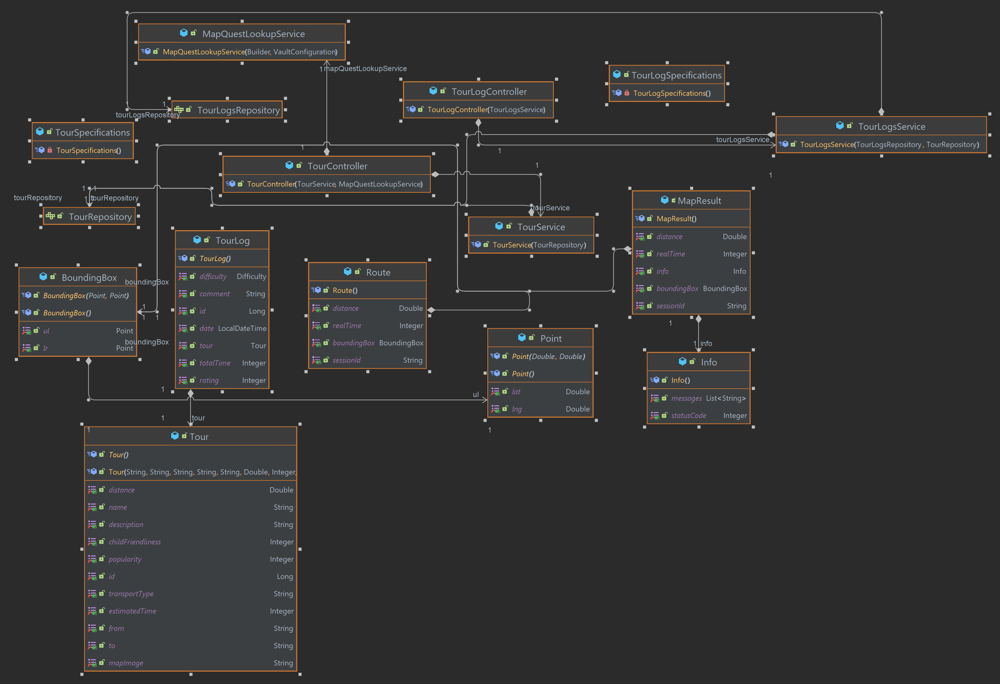
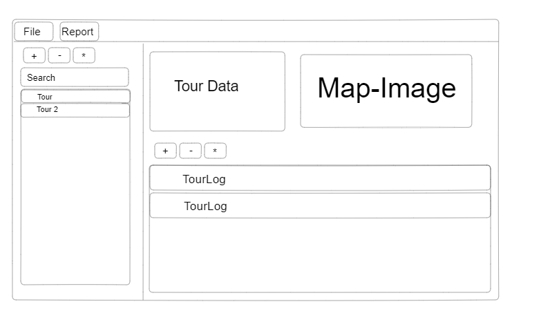
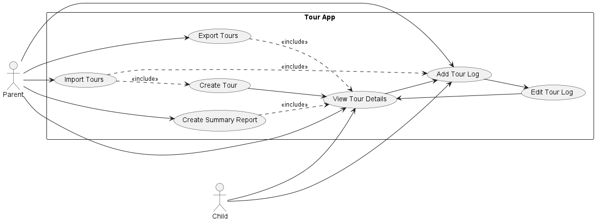
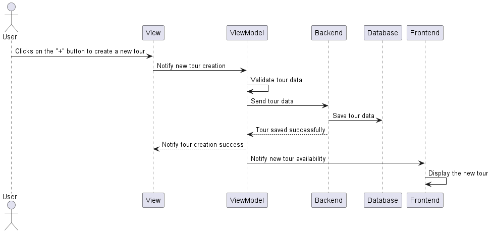

# Setup
## Dev Environment
**Postgres Setup**
1. Start Postgres & Vault
   - `make up`
2. Connect to vault running on Port :8989
   - login using the token: 00000000-0000-0000-0000-000000000000
   - add the secrets like in the example.vault.json

# Design & Architecture

## 1 Introduction
This document provides an overview of the design and architecture of the project. The project consists of a backend component developed using Spring Boot with Vault for secret management and a frontend component developed using Spring Boot with JavaFX. The backend component follows the reactive paradigm for writing asynchronous code.

## 2 Backend Architecture
The backend architecture is based on the Spring Boot framework, which provides a robust and scalable foundation for building Java applications. The use of Spring Boot allows for easy configuration, dependency injection, and integration with other Spring projects.

### 2.1 Spring Boot

Spring Boot is a framework that simplifies the development of Java applications by providing a convention-over-configuration approach. It allows developers to quickly create standalone, production-ready applications with minimal setup and configuration.

### 2.2 Reactive Paradigm

The backend component of the project follows the reactive programming paradigm. Reactive programming is an asynchronous programming model that enables the efficient handling of concurrent requests and supports high-performance, scalable applications. It is based on the principles of non-blocking I/O, event-driven architecture, and functional programming.

### 2.3 Vault for Secret Management

Secret management is an important aspect of application security. In this project, Vault is used for securely storing and managing secrets, such as API keys, database credentials, and other sensitive information. Vault provides a centralized and encrypted storage solution, ensuring that secrets are protected from unauthorized access.

## 3 Frontend Architecture
The frontend component of the project is developed using Spring Boot with JavaFX, which is a framework for building rich client applications in Java. JavaFX provides a set of libraries and tools for creating user interfaces and interacting with backend services.

### 3.1 Spring Boot with JavaFX

Spring Boot with JavaFX allows for the development of modern, responsive, and cross-platform user interfaces. It integrates with the backend seamlessly, enabling efficient communication and data transfer between the frontend and backend components.

### 3.2 Secrets Storage in .env File

In the frontend component, secrets are stored in an .env file. The .env file is a text file that contains key-value pairs representing environment variables. Storing secrets in a separate file ensures that sensitive information is not exposed in the source code repository.

Integration between Backend and Frontend
The backend and frontend components are integrated using RESTful APIs. The backend exposes a set of RESTful endpoints that the frontend can invoke to retrieve data and perform operations. The frontend component communicates with the backend asynchronously, leveraging the reactive programming model.

### 3.3 UX

The program offers the following features:
Tour Management:
- Create, delete, and edit tours. 
2. Tour Details:
- When a tour is clicked, users can view its details, including a picture of the route from the start to the destination, and a table with tour logs.
3. Tour Log Management:
- Create, delete, and edit tour logs associated with a tour.
4. Export and Import:
- Export tours with their tour logs as JSON files.
- Import previously exported JSON files.
5. Loading Indicator:
- Displays a loading indicator when the frontend is waiting for backend processes to complete.

### 3.4 Use-Cases

Creating a New Tour:

- User opens the app and navigates to the "Create Tour" section.
- User provides a name, start location, destination, description, and mode of transport for the tour.
- User submits the tour details, and the app saves the information.

Viewing Tour Details:
- User opens the app and selects a previously created tour from the list.
- User clicks on the tour to view its details.
- The app displays the name, start location, destination, description, and mode of transport for the selected tour.
- Additionally, an image of the route is shown to give a visual representation of the tour. 

Adding Tour Logs:
- User selects a tour from the list and clicks on it to view its details.
- The app displays the tour information along with a table of existing tour logs (if any).
- User clicks on the "Add Tour Log" button.
- User fills in the comment, duration, difficulty, and rating for the tour log.
- User submits the tour log, and the app saves it.

Editing Tour Logs:
- User selects a tour from the list and clicks on it to view its details.
- The app displays the tour information along with the table of existing tour logs.
- User selects a tour log from the table to edit.
- The app presents a form with pre-filled information for the selected tour log.
- User modifies the comment, duration, difficulty, or rating as needed.
- User saves the changes, and the app updates the tour log.

## 4 Conclusion
This documentation has provided an overview of the design and architecture of the project. The backend component is built using Spring Boot with Vault for secret management, following the reactive programming paradigm. The frontend component is developed using Spring Boot with JavaFX and stores secrets in an .env file. The integration between the backend and frontend is achieved through RESTful APIs.

# Lessons Learned

During the development of the project, several lessons were learned that can be valuable for future projects. Here are some of the key lessons learned:
- Proper Secret Management: The importance of securely storing and managing sensitive information using Vault for the backend and an .env file for the frontend was highlighted.
- Reactive Programming Benefits: Adopting the reactive programming paradigm in the backend enabled better performance, scalability, and responsiveness by leveraging asynchronous and non-blocking code.
- Framework Selection: Choosing Spring Boot for both the backend and frontend provided a solid foundation, simplifying configuration, dependency injection, and integration while enabling the creation of a modern user interface with JavaFX.
- Separation of Concerns: Separating the backend and frontend components into distinct layers improved code organization, modularity, and ease of maintenance by applying the principle of separation of concerns.
- Documentation and Collaboration: Effective documentation and collaboration, facilitated by up-to-date documentation, clear communication, and collaborative tools, were crucial for successful teamwork and project outcomes.
- Testing and Quality Assurance: Prioritizing thorough testing, including unit tests, integration tests, and manual testing, helped identify and resolve issues early, ensuring a reliable and robust application.
- Error Handling and Logging: Implementing robust error handling mechanisms and comprehensive logging proved essential for effective debugging and troubleshooting, enabling timely issue resolution.

# Design pattern
Used Design patterns: 
- MVVM 
- Dependency Injection
- Interface pattern
- Repository pattern

# Unit-Test Design
For the purpose of testing the controller classes, a systematic and organized approach was employed. The AAA (Arrange-Act-Assert) pattern was followed, enabling clear separation of the test setup, execution of actions, and verification of outcomes. To ensure controlled and isolated testing, extensive mocking techniques were employed, including the use of spies to simulate and monitor the behavior of relevant components and dependencies. These strategies facilitated thorough evaluation of the controller classes, resulting in comprehensive test coverage and reliable assessment of their functionality and interactions.

# Features
### Vault Integration
Secret management is implemented using Vault, which provides a secure and centralized storage solution for sensitive information.

### Multi-Repository Structure
The project follows a multi-repository structure, consisting of separate repositories for the frontend JavaFX and the backend server components. This separation allows for better code organization, modularity, and maintainability.

# Timespent
- 15h Research (Spring Boot, Vault, Reactive Library)
- 30h Backend
- 30h Frontend

# GitHub - Link
https://github.com/sxript/swen-fx
